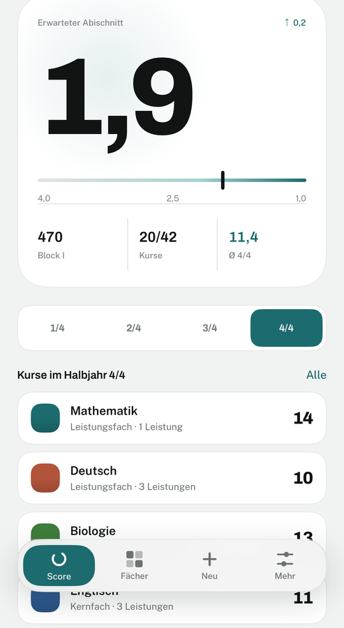
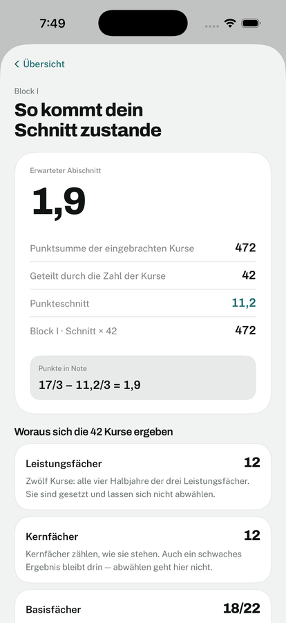
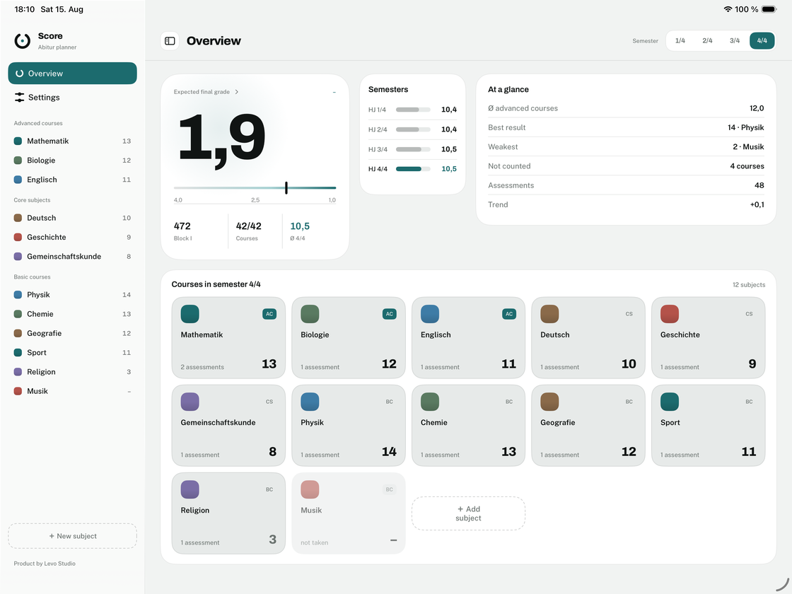

<p align="center">
  <picture>
    <source media="(prefers-color-scheme: dark)" srcset=".github/assets/logo-dark.svg">
    
  </picture>
</p>

<p align="center">
  Abi-Planer für Baden-Württemberg · SwiftUI · iOS und iPadOS 26
</p>

---

Score rechnet Block I des baden-württembergischen Abiturs: Noten werden als
einzelne Leistungen erfasst, daraus entsteht je Halbjahr ein Ergebnis von 0 bis 15,
und aus den 42 eingebrachten Kursen der erwartete Abischnitt. Alles liegt in der
privaten iCloud des Nutzers — es gibt kein Backend und kein Konto.

<table>
  <tr>
    <td width="50%">
      <picture>
        <source media="(prefers-color-scheme: dark)" srcset=".github/assets/dashboard-dark.png">
        
      </picture>
    </td>
    <td width="50%">
      <picture>
        <source media="(prefers-color-scheme: dark)" srcset=".github/assets/blockone-dark.png">
        
      </picture>
    </td>
  </tr>
</table>

<picture>
  <source media="(prefers-color-scheme: dark)" srcset=".github/assets/ipad-dark.png">
  
</picture>

## Die Block-I-Regel

Das Abitur besteht aus zwei Blöcken: Block I sind die Halbjahresergebnisse der
Kursstufe, Block II die Prüfungen. Score rechnet Block I.

Es gehen **42 Halbjahresergebnisse** ein:

| | Kurse | Auswahl |
|---|---|---|
| Leistungsfächer | 12 | gesetzt — alle vier Halbjahre der drei Fächer |
| Kernfächer | so viele, wie belegt sind | gesetzt — zählen, wie sie stehen |
| Basisfächer | was von den 30 übrigen Plätzen bleibt | die besten Ergebnisse rücken nach |

Zwölf Kurse kommen aus den Leistungsfächern, dreissig aus den übrigen Fächern.
Innerhalb dieser dreissig sind die Kernfächer nicht ausschliessbar — Deutsch,
Mathematik, die Fremdsprache, Geschichte, Gemeinschaftskunde und eine
Naturwissenschaft. Erst was danach übrig ist, geht an die besten Basisfächer.

Die Rechnung selbst ist ein Mittelwert. Interessant ist, *welche* Kurse
hineingehen: ein gutes Basisfach verdrängt ein schwaches, ein schwaches Kernfach
lässt sich dagegen nicht loswerden. Deshalb sind Kern- und Basisfach im Datenmodell
zwei verschiedene Typen und nicht bloss ein Namensabgleich.

Aus dem Punkteschnitt der eingebrachten Kurse wird der erwartete Abischnitt:

```
Note = 17/3 − Punkteschnitt/3      auf 1,0 bis 4,0 begrenzt
```

Wer ein Fach über die Pflicht hinaus belegt hat, kann festlegen, wie viele seiner
Halbjahre es einbringt. Diese Grenze greift **vor** der Auswahl — ein Kurs, den
das eigene Fach nicht einbringt, soll keinem anderen den Platz wegnehmen.

### Abweichung von der amtlichen Fassung

Die amtliche Regel kennt zusätzlich zwei doppelt gewertete Leistungsfächer und
rechnet mit 40 Ergebnissen durch 48. Score folgt bewusst der vereinfachten
Fassung: **42 Ergebnisse ohne Doppelwertung**. Das ist eine Produktentscheidung,
kein Versehen — aber es heisst, dass der angezeigte Schnitt nicht der Schnitt
des Prüfungsamts ist. Details in
[`Score/Calculation/BlockOneCalculator.swift`](Score/Calculation/BlockOneCalculator.swift).

## Verschlüsselung

Score speichert ausschliesslich in der privaten CloudKit-Datenbank des Nutzers.
Verschlüsselt wird ein Feld aber nur, wenn es `@Attribute(.allowsCloudEncryption)`
trägt — dann landet es in `CKRecord.encryptedValues`, und der Schlüssel hängt am
iCloud-Schlüsselbund. Apple sieht die Struktur der Daten, nicht ihre Werte.

**25 von 25 gespeicherten Attributen** tragen das Flag. Ausgenommen sind nur die
vier Beziehungen: sie werden als `CKReference` gespiegelt, und eine Referenz muss
für CloudKit auflösbar bleiben.

Das ist eine Einbahnstrasse. Nach dem ersten Deploy des Schemas in die
Production-Datenbank lässt sich ein Feld nicht mehr nachträglich verschlüsseln —
verschlüsselt und unverschlüsselt sind für CloudKit zwei verschiedene Feldtypen.
Ein vergessenes Feld bliebe dauerhaft im Klartext. Deshalb läuft vor jedem
Schema-Deploy:

```bash
python3 scripts/check-encryption.py
# 25 von 25 gespeicherten Attributen verschlüsselt, 4 Beziehungen ausgenommen.
```

Exit 0, wenn alles sitzt, sonst 1.

## Architektur

```
Score/
  Calculation/   Rechenkern — SubjectMath, BlockOneCalculator
  Models/        SwiftData-Modelle und der Fächerkatalog
  Core/Design/   Farben, Typografie, Masse, Bewegung, Komponenten
  Core/…         Daten, Einstellungen, Formatierung, Medien
  Features/      ein Ordner je Bildschirm
ScoreTests/      85 Tests in 13 Suites (Swift Testing)
scripts/         check-encryption.py
```

**Der Rechenkern kennt keine Datenbank.** `BlockOneCalculator` und `SubjectMath`
arbeiten auf reinen `Sendable`-Werten, nicht auf `@Model`-Klassen. Deshalb lässt
sich die Auswahllogik ohne `ModelContainer`, ohne Simulator-Zustand und ohne
CloudKit testen — und die Tests laufen in Millisekunden statt Sekunden.

**Die Design-Schicht ist die einzige Quelle für Farbe, Mass und Bewegung.**
`ScorePalette` löst jeden Token dynamisch nach Hell und Dunkel auf, `ScoreMetrics`
hält Radien und Abstände, `ScoreTypography` die Schriftgrade. `ScoreMotion` trägt
die Bewegungssprache: dort steht auch die Behandlung von *Bewegung reduzieren*,
damit sie nicht an einer von hundert Aufrufstellen vergessen werden kann.

**iPhone und iPad teilen Modelle, Rechenkern und Design-Schicht**, haben aber
eigene Shells (`MainShell` mit Tab-Bar, `PadShell` mit Sidebar und Split View).

Oberflächensprachen: **Deutsch und Englisch**, 268 Einträge im String-Katalog.
Schriften sind Archivo und Public Sans, beide unter der SIL Open Font License.

## Bauen und Testen

Voraussetzung ist Xcode 26. `xcode-select` zeigt auf vielen Rechnern auf die
CommandLineTools — die können kein iOS-Projekt bauen. Entweder dauerhaft
umstellen (`sudo xcode-select -s /Applications/Xcode.app/Contents/Developer`)
oder je Aufruf voranstellen:

```bash
DEVELOPER_DIR=/Applications/Xcode.app/Contents/Developer xcodebuild \
  -project Score.xcodeproj -scheme Score \
  -destination 'platform=iOS Simulator,name=iPhone 17 Pro' \
  CODE_SIGNING_ALLOWED=NO build
```

```bash
DEVELOPER_DIR=/Applications/Xcode.app/Contents/Developer xcodebuild test \
  -project Score.xcodeproj -scheme Score \
  -destination 'platform=iOS Simulator,name=iPhone 17 Pro' \
  CODE_SIGNING_ALLOWED=NO
```

`CODE_SIGNING_ALLOWED=NO` ist Absicht: ohne Signierung fehlt das iCloud-Entitlement,
und die App fällt automatisch auf einen rein lokalen Speicher zurück
(`CloudKitAvailability`). Ohne diese Prüfung stürzt das CloudKit-Mirroring
asynchron ab, lange nachdem `ModelContainer(for:)` erfolgreich zurückgekehrt ist.

Das Projekt nutzt synchronisierte Ordner — neue Dateien unter `Score/` landen
ohne Zutun im Target.

## Lizenz

Source-available, **nicht** Open Source. Der Code darf gelesen und für sich selbst
gebaut und ausgeführt werden. Nicht erlaubt sind kommerzielle Nutzung, abgeleitete
Werke und die Weitergabe veränderter Fassungen. Dafür braucht es eine schriftliche
Vereinbarung mit Levo Studio.

Der vollständige Text steht in [`LICENSE`](LICENSE).

© 2026 Levo Studio
